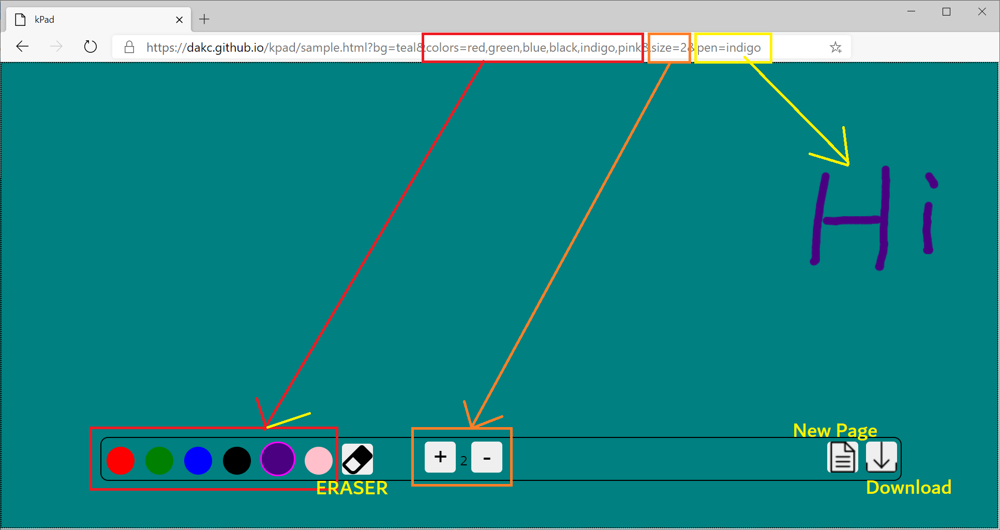
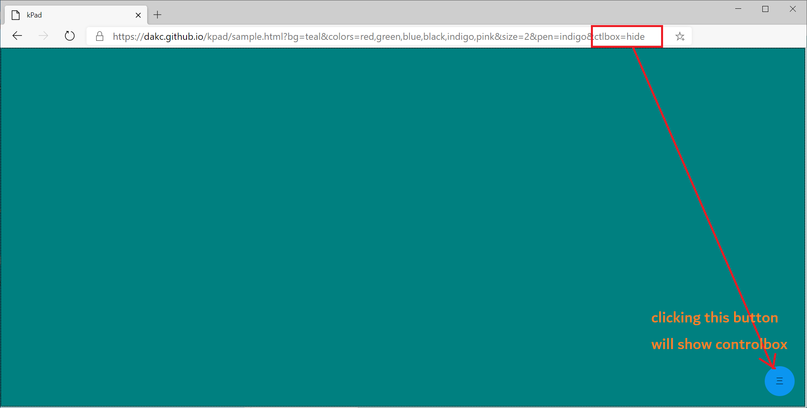

# kpad
javascript library for creating sketchpad using canvas.


## usage
kpad will create a canvas inside given DOM element.
By setting the size of outer element, we can easily manipulate different size of canvas.
```javascript
const parentElement = document.querySelector(".sign");
new kpad(parentElement);
```

## pen color
By passing "colors" which is simply arrays of color as option, we can use various types of pen.It will show a control box which is draggable and can be moved to any place at any time.
```javascript
const parentElement = document.querySelector(".sign");
const options = {colors: ["red", "yellow", "blue"]}
new kpad(parentElement, options);
```

## options
We can pass following additional parameter as per our need.
```javascript
const parentElement = document.querySelector(".sign");
const options = {
    colors: ["red", "yellow", "blue"] // users will be able to chose 3 different pens
    backgroundColor: "green", // background color of sketchpad, default is white
    size: 5, // width of the pen, default is 1
    color: "black", // pen color, default is red
    sizeIncreement: 10, // size by which pen width will be increased or decreased, default is 2
};
new kpad(parentElement, options);
```
# Demo

see here for [DEMONSTRATION](https://dakc.github.io/kpad/sample.html).

This page shows various use cases.
- download the content as image
- show or hide controlbox -> 
[pass "ctlbox=hide" in the url](https://dakc.github.io/kpad/sample.html?ctlbox=hide)
- change the background from url -> 
[pass "bg=color name" in the url](https://dakc.github.io/kpad/sample.html?bg=gray)
- change the color list from url -> 
[pass "colors=name of color separated by comma" in the url](https://dakc.github.io/kpad/sample.html?colors=red,blue,yellow)
- change the default pen color from url -> 
[pass "pen=color name" in the url](https://dakc.github.io/kpad/sample.html?pen=black)
- change the default pen size from url -> 
[pass "size=number" in the url](https://dakc.github.io/kpad/sample.html?size=5)

## ※ multiple parameters with controlbox
[https://dakc.github.io/kpad/sample.html?bg=teal&colors=red,green,blue,black,indigo,pink&size=2&pen=indigo](https://dakc.github.io/kpad/sample.html?bg=teal&colors=red,green,blue,black,indigo,pink&size=2&pen=indigo)



## ※ multiple parameters without controlbox
[https://dakc.github.io/kpad/sample.html?bg=teal&colors=red,green,blue,black,indigo,pink&size=1&pen=indigo&ctlbox=hide](https://dakc.github.io/kpad/sample.html?bg=teal&colors=red,green,blue,black,indigo,pink&size=1&pen=indigo&ctlbox=hide)



# How to implement
see here for [how to use kpad](./sample.html) in html.


# lisence
MIT